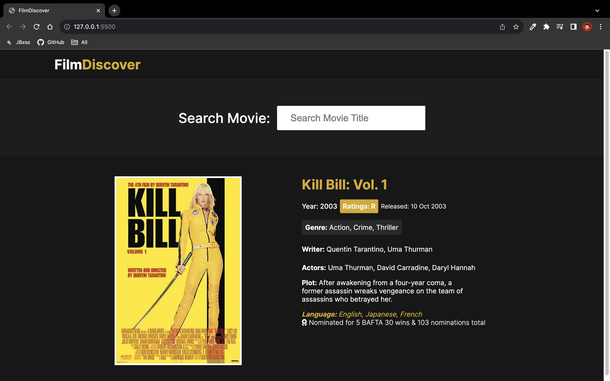

# FilmDIscover

Este es un buscador de películas web que utiliza la API de OMDb para obtener información sobre películas. La aplicación está construida con HTML, CSS y JavaScript.

## Características

- **Búsqueda de Películas:** Permite a los usuarios buscar información sobre películas mediante la API de OMDb.
- **Detalles de Películas:** Muestra detalles como el título, año de lanzamiento, clasificación, descripción y más.
- **Interfaz Intuitiva:** Diseño simple y fácil de usar.

## Capturas de Pantalla

*Vista Detallada de la Pelicula Escogida*

*Vista de Resultados del Buscador*

## Uso

2. Ingresa a [FilmDiscover](https://jbxss.github.io/FilmDiscover/) en tu navegador web.
3. Ingresa el nombre de la película en el campo de búsqueda y presiona Enter.
4. Explora la información de la película.

## Tecnologías Utilizadas

- HTML
- CSS
- JavaScript

## API Utilizada

Este proyecto utiliza la API de OMDb para obtener datos de películas. Puedes encontrar más información sobre la API [aquí](https://www.omdbapi.com/).

## Licencia

Este proyecto está licenciado bajo la Licencia MIT. Consulta el archivo [LICENSE](./LICENSE) para más detalles.
